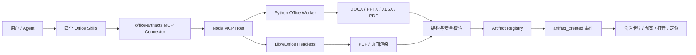

# MeteoMate Office Artifact Runtime V1

状态：第一、二阶段工程实现已落地，Office 兼容性人工验收待发布前完成；第三阶段待实施

适用产品：`products/meteo-office-desktop`

设计日期：2026-07-24

## 1. 决策摘要

MeteoMate V1 采用“技能负责工作流，MCP Connector 负责受控文件操作，Artifact Registry 负责结果管理”的 Office 能力架构：

- 面向用户提供四项独立能力：Documents、Presentations、Spreadsheets、PDF。
- 四项能力共享一个 `office-artifacts` stdio MCP Connector 和一套按需安装的本地 Managed Runtime。
- 所有创建和编辑操作必须经过“生成或编辑 → 渲染 → 校验 → 注册 Artifact”的闭环。
- Office 文件被视为二进制 Artifact，不允许模型直接对 OOXML 或 PDF 文件做普通文本补丁。
- V1 不引入新的插件体系。能力以四个 bundled skills 和一个 connector 接入现有 Capability Center；未来可在 SkillHub 中打包成一个原子安装的“Office 工作台”能力包。
- 运行时契约与部署位置解耦。本地桌面版使用本地 sidecar，未来服务端可以在不改变 MCP 工具契约的前提下替换为远端执行器。

本方案参考 Codex 的能力分层和严格 render-and-verify 工作流，但不依赖其私有实现。MeteoMate 的实现重点是可控模板、产物血缘、桌面离线运行和中文业务文档兼容性。

## 2. 产品假设

V1 服务于 Agent 驱动的 Office 产物创建、编辑、转换、预览和校验，而不是在 MeteoMate 内部复制一个完整的 Word、PowerPoint 或 Excel。

典型场景包括：

- 根据预报结论和业务模板生成 Word 专报并导出 PDF。
- 根据已有 PPTX 模板替换标题、图片、表格和图表数据。
- 生成或修改 XLSX 台账、统计表和图表，并检查公式错误。
- 合并、拆分、旋转、加水印或填写 PDF 表单。
- 对现有 Office 文件做结构化检查、页面渲染和兼容性验证。

## 3. V1 范围

### 3.1 第一、二阶段已支持

- DOCX：检查、创建、基于模板创建、结构化编辑、转 PDF、页面预览、结构和渲染校验。
- PPTX：检查、创建、基于模板创建、结构化编辑、转 PDF、逐页预览、结构和渲染校验。
- XLSX：检查、创建、结构化编辑、公式重算、转 PDF、工作表预览、结构和渲染校验。
- PDF：检查、创建、合并、拆分、旋转、加水印、填写 AcroForm、渲染和校验。
- 中文字体预检、模板锚点检查、受控的图片嵌入和 Artifact 血缘记录。

### 3.2 V1 后续目标

- Template Center：模板扫描、锚点可视化、版本管理和项目绑定。

### 3.3 不支持

- 内嵌 WYSIWYG Office 编辑器和实时多人协作。
- VBA、宏执行和宏格式文件。
- 任意脚本、Shell、Python 或 LibreOffice UNO 代码执行。
- 任意 OOXML ZIP 条目的低层二进制修改。
- 对所有 Office 特性的无损往返编辑。
- PowerPoint 动画、复杂 SmartArt 和任意嵌入对象编辑。
- Word 修订模式、批注协作、脚注和复杂域代码编辑。
- PDF 数字签名、可信时间戳、真正不可恢复的内容涂黑。
- OCR、扫描件版面恢复和云盘同步。
- 发布、公文交换或外部发送。

如果后续出现明确的所见即所得或实时协作需求，再单独评估 Tiptap、Microsoft Office Add-in、ONLYOFFICE 或 Collabora。它们不属于 V1 生成运行时的依赖。

## 4. 总体架构



职责边界：

| 层 | 职责 | 不负责 |
| --- | --- | --- |
| Skill | 选择工具、组织业务步骤、要求渲染和校验 | 直接读写二进制文件 |
| Connector | 暴露固定 MCP 工具、校验参数、实施权限策略 | 业务文案和模板内容决策 |
| Runtime | 解析、生成、编辑、转换、渲染、校验 | 用户界面和会话状态 |
| Artifact Registry | 持久化产物元数据、状态、哈希和血缘 | 执行 Office 操作 |
| Renderer | 展示文件卡片、预览和操作入口 | 从回复文本猜测产物 |

## 5. 能力包装

### 5.1 Skills

新增四个 bundled skill：

```text
bundled-skills/
├── documents/
│   ├── SKILL.md
│   └── meteomate.json
├── pdf/
│   ├── SKILL.md
│   └── meteomate.json
├── presentations/
│   ├── SKILL.md
│   └── meteomate.json
└── spreadsheets/
    ├── SKILL.md
    └── meteomate.json
```

每个 Skill 必须明确：

- 允许使用的 Office 工具。
- 推荐的检查、修改、渲染、校验顺序。
- 格式特有的限制和失败处理。
- 产物必须写入当前项目工作区，禁止写入任意系统路径。
- 修改现有文件时默认生成新版本，不原地覆盖。
- 未通过校验的文件不得描述为“已完成”。

### 5.2 Connector

Capability Center 中新增一个 `office-artifacts` connector。四个 Skill 共同依赖该 connector，不为每种格式启动独立服务。

安装和启用是原子操作：

1. 校验 Managed Runtime 的平台、架构、版本和 SHA-256。
2. 注册并启用 `office-artifacts` connector。
3. 安装或启用四个 bundled skill。
4. 通过 MCP `initialize` 和 `tools/list` 验证固定的 17 个工具。
5. 提示用户创建新 Session，使能力快照生效。

任一步失败都回滚本次安装状态，不允许留下“Skill 已启用但运行时不可用”的半安装状态。

## 6. Managed Runtime

### 6.1 运行时组成

V1 目标基线：

| 组件 | 基线版本 | 用途 |
| --- | --- | --- |
| Node.js | 随产品锁定 | MCP host、参数校验、进程与 Artifact 编排 |
| `@modelcontextprotocol/sdk` | 锁定版本 | stdio MCP 服务 |
| Python | 产品锁定的独立运行时 | Office/PDF 文件处理 |
| `python-docx` | 1.2.0 | DOCX 结构化读写 |
| `python-pptx` | 1.0.2 | PPTX 解析和模板编辑 |
| `openpyxl` | 3.1.5 | XLSX 解析和编辑 |
| `XlsxWriter` | 3.2.9 | 新建高质量 XLSX |
| `pypdf` | 6.10.0 | PDF 结构操作 |
| `pdfplumber` | 0.11.9 | PDF 文本和版面检查 |
| `ReportLab` | 4.4.9 | PDF 创建 |
| `pypdfium2` | 5.11.0 | PDF 页面渲染 |
| `Pillow`、`lxml`、`defusedxml` | 锁定版本 | 图片、OOXML 和 XML 安全处理 |
| LibreOffice Stable | 26.2.4 | Headless 转换、公式重算和兼容性检查 |

这些版本是首个实现基线，不允许使用浮动版本。发布构建必须生成 runtime manifest、SHA-256、SBOM 和许可证清单；实际分发前以锁文件和 SBOM 的许可证结果为准。

当前 Runtime 安装 DOCX/PPTX/XLSX/PDF 所需依赖：`python-docx`、`python-pptx`、`openpyxl`、`XlsxWriter`、`pypdf`、`pdfplumber`、`ReportLab`、`pypdfium2`、`Pillow`、`lxml` 和 `defusedxml`。

### 6.2 打包策略

当前版本在发布构建时按平台和架构准备 Office Runtime，并随应用打包：

```text
runtime/office/<platform>-<arch>/
├── manifest.json
├── worker.py
├── python/
└── libreoffice/
```

`manifest.json` 至少包含：

```json
{
  "schemaVersion": "meteomate.office-runtime/v1",
  "runtimeVersion": "1.3.0",
  "platform": "darwin",
  "arch": "arm64",
  "createdAt": "2026-07-24T00:00:00Z",
  "pythonProvisioning": "portable-home",
  "packages": {
    "python-docx": "1.2.0",
    "python-pptx": "1.0.2",
    "openpyxl": "3.1.5",
    "XlsxWriter": "3.2.9",
    "pypdf": "6.10.0"
  },
  "criticalFiles": [
    {
      "path": "python/bin/python3",
      "sizeBytes": 49968,
      "sha256": "..."
    }
  ],
  "requirements": {
    "path": "services/office-mcp/python/requirements.lock",
    "sha256": "..."
  }
}
```

manifest 记录运行时版本、平台、架构、锁定依赖版本，以及 Python、LibreOffice 和 Worker 关键入口的相对路径、大小和 SHA-256。应用代码签名保护完整随包目录，启动前再次验证 manifest 和关键入口。运行时独立下载、签名 manifest、SBOM、许可证清单和原子版本切换属于发布基础设施后续项。

发布构建通过 `METEOMATE_PYTHON_HOME_PATH` 和 `METEOMATE_LIBREOFFICE_APP_PATH` 提供完整、可搬迁的上游运行时。开发环境允许以下显式覆盖：

- `METEOMATE_PYTHON_PATH`
- `METEOMATE_SOFFICE_PATH`

覆盖路径仍必须通过版本探测和可执行文件校验，不能跳过安全策略。

### 6.3 LibreOffice 隔离

每个转换任务使用独立临时目录和独立 LibreOffice user profile：

- 禁止加载用户真实 LibreOffice 配置。
- 禁止宏执行和外部数据刷新。
- 禁止网络访问。
- 设置硬超时，超时后终止完整进程组。
- 单机默认并发为 1，任务通过本地队列串行执行。
- 任务完成后清理 profile、中间文件和标准输出日志。

## 7. MCP 工具契约

### 7.1 工具清单

Connector 固定暴露以下 17 个工具：

| 工具 | 类型 | 说明 |
| --- | --- | --- |
| `docx_inspect` | 只读 | 提取 DOCX 结构、样式、锚点、媒体和风险 |
| `docx_resolve_selection` | 只读 | 将预览选区解析为唯一正文段落锚点 |
| `docx_create_from_markdown` | 写入 | 从受控 Markdown 行创建普通 DOCX |
| `docx_create` | 写入 | 从规范或模板创建 DOCX |
| `docx_edit` | 写入 | 对现有 DOCX 执行结构化操作 |
| `docx_edit_selection` | 写入 | 复核源文件与段落锚点，生成并校验新的 DOCX 版本 |
| `pptx_inspect` | 只读 | 提取母版、布局、页面、形状和锚点 |
| `pptx_create` | 写入 | 从规范或模板创建 PPTX |
| `pptx_edit` | 写入 | 对现有 PPTX 执行结构化操作 |
| `xlsx_inspect` | 只读 | 提取工作表、表格、公式、图表和风险 |
| `xlsx_create` | 写入 | 创建 XLSX |
| `xlsx_edit` | 写入 | 对现有 XLSX 执行结构化操作 |
| `pdf_inspect` | 只读 | 提取 PDF 页面、文本、表单、附件和风险 |
| `pdf_create` | 写入 | 从内容规范创建 PDF |
| `pdf_transform` | 写入 | 合并、拆分、旋转、加水印或填写表单 |
| `artifact_render` | 只读派生 | 将 Office/PDF 文件渲染为受控预览 |
| `artifact_validate` | 只读 | 执行结构、渲染、字体、安全和兼容性校验 |

工具名称和语义在 V1 内保持稳定。新增格式或高风险操作时添加新工具，不扩展成接受任意代码的通用执行工具。

### 7.2 通用输入

工作区根目录由 Connector 启动配置注入，不由模型传入。工具参数只接受逻辑工作区标识和工作区内的相对路径：

```json
{
  "schemaVersion": "meteomate.office/v1",
  "workspaceId": "project-current",
  "sourcePath": "artifacts/report-v1.docx",
  "outputPath": "artifacts/report-v2.docx"
}
```

约束：

- `workspaceId` 是运行时绑定的逻辑标识，不是文件系统路径。
- `sourcePath`、`templatePath` 和 `outputPath` 必须是规范化相对路径。
- 拒绝绝对路径、`..`、符号链接逃逸、设备路径和网络路径。
- 输出目录由 Connector 创建；目录权限为 `0700`，文件权限为 `0600`。
- 创建和编辑默认拒绝覆盖现有文件。
- 预览选区修改必须使用 `docx_edit_selection`；源文件 hash、唯一段落锚点或选区 hash 任一不匹配即拒绝写入。
- `docx_edit_selection` 默认在原文件旁生成 `_已修改` 版本，名称冲突时递增编号，并在返回前完成结构、安全与逐页渲染检查。
- `outputPath` 的扩展名必须与工具格式一致。
- 单次调用必须声明 `schemaVersion`。

### 7.3 通用结果

所有成功的创建、编辑和转换工具返回结构化 Artifact，不把文件内容编码为 Base64：

```json
{
  "schemaVersion": "meteomate.office/v1",
  "artifact": {
    "id": "art_01...",
    "name": "华东区域强降水专报.docx",
    "type": "document",
    "path": "artifacts/华东区域强降水专报.docx",
    "mediaType": "application/vnd.openxmlformats-officedocument.wordprocessingml.document",
    "status": "draft",
    "hash": "sha256:...",
    "size": 248163,
    "metadata": {
      "format": "docx",
      "runtimeVersion": "1.1.0",
      "sourceArtifactId": null,
      "sourceHash": null,
      "templateId": "forecast-report",
      "templateVersion": "2.1.0"
    },
    "lineage": {
      "taskId": "task_...",
      "runId": "run_...",
      "contextId": "ctx_...",
      "expertId": null,
      "evidenceIds": [],
      "toolCallId": "call_..."
    }
  },
  "warnings": []
}
```

`inspect`、`render` 和 `validate` 同样返回 `structuredContent`。可读摘要只用于聊天显示，不得成为 Renderer 发现文件的依据。

### 7.4 通用错误

MCP 错误结果使用稳定错误码：

| 错误码 | 含义 |
| --- | --- |
| `INVALID_ARGUMENT` | 参数或版本不合法 |
| `WORKSPACE_VIOLATION` | 路径越界或符号链接逃逸 |
| `UNSUPPORTED_FEATURE` | 文件包含 V1 不支持的特性 |
| `SOURCE_CHANGED` | `sourceHash` 乐观锁失败 |
| `OUTPUT_EXISTS` | 输出文件已存在 |
| `FONT_MISSING` | 必需字体未安装 |
| `SECURITY_REJECTED` | 宏、脚本、外链或压缩包风险 |
| `CONVERSION_FAILED` | LibreOffice 或格式转换失败 |
| `RENDER_FAILED` | 页面渲染失败 |
| `VALIDATION_FAILED` | 结构或兼容性校验失败 |
| `RESOURCE_LIMIT` | 页数、大小、像素或解压限制超出 |
| `RUNTIME_UNAVAILABLE` | 运行时不存在、损坏或版本不匹配 |

错误详情可以包含字段路径、页码、工作表或形状 ID，但不得回传工作区绝对路径和完整进程环境。

## 8. 格式工具模型

### 8.1 Inspect

四个 `*_inspect` 工具统一接受：

```json
{
  "schemaVersion": "meteomate.office/v1",
  "workspaceId": "project-current",
  "sourcePath": "inputs/source.docx",
  "include": ["structure", "anchors", "fonts", "media", "security"]
}
```

返回规范化结构和稳定 ID。稳定 ID 供后续 edit 操作引用，避免依赖易变化的文本位置。

格式结构：

- DOCX：sections、paragraphs、runs、tables、styles、headers、footers、bookmarks、content controls、media。
- PPTX：masters、layouts、slides、shapes、placeholders、notes、media、charts。
- XLSX：worksheets、named ranges、tables、formulas、charts、images、print areas、hidden content。
- PDF：pages、text blocks、forms、outlines、attachments、JavaScript、metadata、encryption。

### 8.2 Create

四个 `*_create` 工具接受版本化格式规范：

```json
{
  "schemaVersion": "meteomate.office/v1",
  "workspaceId": "project-current",
  "outputPath": "artifacts/output.docx",
  "templatePath": "templates/forecast-report.docx",
  "spec": {
    "schemaVersion": "meteomate.docx/v1",
    "document": {}
  }
}
```

`templatePath` 可省略。提供模板时，运行时先校验模板 hash、锚点和字体，再填充内容。规范只能表达白名单内的结构和样式，不接受任意 XML、HTML、JavaScript 或公式脚本。

### 8.3 Edit

编辑工具使用乐观锁和操作列表：

```json
{
  "schemaVersion": "meteomate.office/v1",
  "workspaceId": "project-current",
  "sourcePath": "artifacts/output-v1.docx",
  "sourceHash": "sha256:...",
  "outputPath": "artifacts/output-v2.docx",
  "operations": []
}
```

默认生成新文件；只有未来经过单独权限设计的工具才可原地覆盖。

允许的 V1 操作：

| 格式 | 操作 |
| --- | --- |
| DOCX | 替换锚点文本、插入段落、表格或图片、设置白名单样式、分页、更新页眉页脚 |
| PPTX | 按布局新增页面、替换命名形状文本或图片、更新表格或图表数据、更新备注 |
| XLSX | 设置区域值、公式和样式，新增工作表、表格或图表，冻结窗格，设置打印区域 |
| PDF | 通过 `pdf_transform` 合并、拆分、旋转、加水印、增删页面和填写 AcroForm |

不允许按“第 N 个 run”或“坐标附近文本”执行脆弱修改。无法唯一解析的目标必须失败，并返回候选稳定 ID。

### 8.4 Transform

`pdf_transform` 使用显式动作白名单：

```json
{
  "schemaVersion": "meteomate.office/v1",
  "workspaceId": "project-current",
  "inputs": ["artifacts/a.pdf", "artifacts/b.pdf"],
  "outputPath": "artifacts/combined.pdf",
  "operations": [
    {
      "op": "merge",
      "sources": ["artifacts/a.pdf", "artifacts/b.pdf"]
    }
  ]
}
```

水印和表单填写只接受文本、图片、页码、位置和样式等受控参数。V1 不使用覆盖色块冒充 PDF 内容涂黑。

## 9. 模板契约

### 9.1 锚点

模板必须优先使用格式原生的稳定锚点：

- DOCX：content controls 或 bookmarks。
- PPTX：shape name、placeholder 或 alt text。
- XLSX：named ranges 或 tables。
- PDF：AcroForm field name。

`{{field}}` 文本替换只能作为显式兼容模式，不能作为新模板的默认做法。

### 9.2 Sidecar

每个受管模板配套一个版本化 sidecar：

```json
{
  "schemaVersion": "meteomate.template/v1",
  "id": "forecast-report",
  "version": "2.1.0",
  "format": "docx",
  "sourcePath": "forecast-report.docx",
  "sourceHash": "sha256:...",
  "anchors": {
    "title": {
      "kind": "content-control",
      "required": true,
      "contentType": "text"
    }
  },
  "requiredFonts": ["Source Han Serif SC", "Source Han Sans SC"],
  "constraints": {
    "maxPages": 12
  }
}
```

正式公文和固定业务版式由模板定义。Agent 只负责填充被允许的锚点，不自行重建红头、页眉、页脚、版记等固定结构。

模板更新时必须递增版本并重新计算 hash。Artifact 记录实际使用的模板 ID、版本和 hash。

## 10. 渲染与校验

### 10.1 `artifact_render`

输入：

```json
{
  "schemaVersion": "meteomate.office/v1",
  "workspaceId": "project-current",
  "sourcePath": "artifacts/output.docx",
  "pages": {
    "from": 1,
    "to": 12
  },
  "dpi": 144
}
```

输出：

- 一个预览 PDF；PDF 源文件可以复用自身。
- 按需生成的页面缩略图。
- 页数、页面尺寸和渲染警告。
- `previewManifestPath`，用于 Renderer 延迟加载。

缩略图不以 Base64 写入 localStorage，也不作为完整数组塞入聊天消息。默认只生成首屏缩略图，其余页面在用户打开预览时按需请求。

### 10.2 `artifact_validate`

校验分为五类：

1. 结构：文件可重新打开，OOXML ZIP、关系和内容类型合法。
2. 安全：无宏、脚本、危险附件、外部关系、路径逃逸和压缩炸弹。
3. 字体：必需字体存在，替代字体和缺字被报告。
4. 渲染：转换和页面栅格化成功，无空白页、截断、溢出或明显异常。
5. 兼容性：LibreOffice 可无修复提示打开并重新导出；发布门禁还需 Microsoft Office 样本验证。

返回：

```json
{
  "schemaVersion": "meteomate.office/v1",
  "valid": true,
  "status": "ready",
  "checks": [],
  "warnings": [],
  "previewManifestPath": "artifacts/.previews/art_01/manifest.json"
}
```

状态规则：

```text
draft -> validated -> ready
   \          \          \
    +-------- failed -----+
```

- 创建或编辑成功后为 `draft`。
- 结构和安全检查通过后为 `validated`。
- 必需的渲染、字体和兼容性检查通过后为 `ready`。
- 任一必需检查失败后为 `failed`。
- V1 不由 Office Runtime 设置 `published`；发布属于后续独立工作流。

## 11. Artifact 集成

### 11.1 注册

主进程新增通用的结构化 Artifact collector，递归检查 MCP `structuredContent` 中满足 `meteomate.office/v1` 的 Artifact。

collector 必须：

- 验证路径仍在当前项目工作区。
- 重新计算或验证文件 hash 和大小。
- 调用现有 Artifact Registry 注册产物。
- 保留 task、run、context、expert、template、evidence 和 tool call 血缘。
- 发出标准 `artifact_created` 事件。
- 从持久化消息中移除任何 Base64 或大块预览数据。

回复文本中的文件名正则只能继续承担旧 Connector 的兼容兜底，不得作为 Office Artifact 的主发现机制。

### 11.2 Artifact 元数据

Office Artifact 在现有字段之外增加：

```json
{
  "format": "docx",
  "runtimeVersion": "1.1.0",
  "sourceArtifactId": "art_...",
  "sourceHash": "sha256:...",
  "templateId": "forecast-report",
  "templateVersion": "2.1.0",
  "validation": {
    "status": "ready",
    "validatedAt": "2026-07-24T00:00:00Z"
  },
  "render": {
    "pageCount": 5,
    "previewManifestPath": "artifacts/.previews/art_.../manifest.json"
  }
}
```

### 11.3 界面

会话和项目资产区显示统一 Office 文件卡片：

- 格式图标、文件名、大小、页数或工作表数。
- `draft`、`validated`、`ready` 或 `failed` 状态。
- 打开、在 Finder 中显示、预览。
- 来源 Artifact、模板版本和校验摘要。

预览弹窗：

- DOCX、PPTX、XLSX 使用转换后的 PDF 预览。
- PDF 使用 PDF.js 按页加载。
- 校验失败时仍可查看失败快照，但界面明确显示失败原因。
- 预览缺失时按需调用 render，不在 Renderer 自行启动 LibreOffice。

## 12. 权限与安全

### 12.1 权限分级

| 操作 | 默认策略 |
| --- | --- |
| 工作区内 inspect | 允许 |
| 工作区内 render、validate | 允许 |
| create、edit、transform、convert | 使用 `artifact-approval` 规则确认 |
| 覆盖现有文件 | 拒绝 |
| 删除、发布、签名、外部发送 | 不暴露工具 |
| 任意命令、脚本或宏 | 拒绝 |

只有经过 manifest 校验且工具列表与 allowlist 完全一致的 Connector 才能获得只读免确认能力。运行时或工具列表变化时自动降级为需要确认。

### 12.2 文件安全

- 只允许 `.docx`、`.pptx`、`.xlsx` 和 `.pdf`。
- 明确拒绝 `.docm`、`.pptm`、`.xlsm`、`.xlam` 和旧式二进制格式。
- OOXML 解压前检查总大小、条目数、单条目大小和压缩比。
- 拒绝 ZIP 中的绝对路径、`..`、符号链接和重复覆盖条目。
- XML 解析禁用 DTD、实体扩展和外部实体。
- 默认移除或拒绝 OOXML 外部关系、PDF JavaScript、Launch Action 和附件。
- 图片解码设置像素和内存上限，防止解压炸弹。
- 临时文件只存在于单任务私有目录，并在成功、失败、超时和应用退出时清理。

### 12.3 资源限制

首个实现的默认上限：

| 项目 | 默认上限 |
| --- | --- |
| 输入文件 | 100 MiB |
| OOXML 解压后总量 | 500 MiB |
| OOXML 条目数 | 10,000 |
| PDF 页数 | 1,000 |
| DOCX/PPTX 渲染页数 | 300 |
| XLSX 工作表数 | 200 |
| 单张图片像素 | 80 MP |
| 单工具执行时间 | 120 秒 |
| LibreOffice 转换时间 | 90 秒 |

上限只能通过签名配置调整，不接受模型在工具参数中覆盖。

## 13. 代码落点

全部实现保持在 `products/meteo-office-desktop` 内，不修改共享 `crates/` 或 `ui/`：

```text
products/meteo-office-desktop/
├── bundled-skills/
│   ├── documents/
│   ├── pdf/
│   ├── presentations/
│   └── spreadsheets/
├── capabilities/
│   ├── office-connector.js
│   ├── office-runtime.cjs
│   └── office-artifact-collector.cjs
├── scripts/
│   └── prepare-office-runtime.cjs
├── services/
│   └── office-mcp/
│       ├── package.json
│       ├── src/
│       ├── python/
│       ├── schemas/
│       └── tests/
└── tests/
    ├── office-runtime.cjs
    ├── office-connector.cjs
    └── office-artifacts.cjs
```

后续实施预计修改：

- `capabilities/service.cjs`
- `capabilities/main-wrapper.cjs`
- `capabilities/permission-policy.cjs`
- `main.cjs`
- `renderer-core.js`
- `renderer-actions.js`
- `manifests/capabilities.js`
- `package.json` 和 `package-lock.json`
- 相关 HTML/CSS 和测试文件

因为当前工作区这些文件已有其他未提交修改，实施时必须逐文件复核并只追加 Office 相关差异。

## 14. 分期

### 14.1 第一阶段：Documents + PDF 基础

预计 10–15 个工程日。

交付：

- Managed Runtime 构建准备、随包复制、manifest 校验、解析和健康探测。
- Node MCP host、Python worker、参数 schema 和统一错误。
- DOCX inspect/create/edit。
- PDF inspect/create/transform。
- artifact_render、artifact_validate。
- 通用 Artifact collector。
- 会话文件卡片、第一页缩略图和系统文件打开入口。
- Documents、PDF 两个 Skill。

验收样例：

1. 使用受管模板生成一份中文强降水专报。
2. 文件包含标题、正文、表格、两张天气图、页眉、页脚和页码。
3. 将 DOCX 转成 PDF 并逐页渲染。
4. DOCX 可被 Microsoft Word 和 LibreOffice 打开且不出现修复提示。
5. 预览无文字截断、表格溢出、空白页和字体替换告警。
6. Artifact 状态为 `ready`，包含模板、运行时、hash 和 tool call 血缘。

### 14.2 第二阶段：Presentations + Spreadsheets（已落地）

预计 8–12 个工程日。

交付：

- PPTX inspect/create/edit。
- XLSX inspect/create/edit。
- Presentations、Spreadsheets 两个 Skill。
- 图表数据更新、公式重算、打印区域和逐页预览。
- PowerPoint 和 Excel 兼容性样本测试。

验收样例：

- 从命名形状模板生成 10 页天气会商 PPTX，替换图片、表格和图表数据。
- 生成多工作表 XLSX，包含公式、冻结窗格、表格、图表和打印区域。
- 文件分别在 PowerPoint、Excel 和 LibreOffice 中无修复提示打开。
- 公式缓存经过 LibreOffice 重算，校验报告无 `#REF!`、`#VALUE!` 和 `#DIV/0!`。

### 14.3 第三阶段：Template Center

预计 5–8 个工程日。

交付：

- 模板扫描和锚点可视化。
- Sidecar 生成、校验、版本管理和项目级模板绑定。
- 模板发布前兼容性检查。
- SkillHub 中的“Office 工作台”原子能力包。

### 14.4 可选阶段：实时编辑

只有业务明确要求应用内所见即所得或实时协作时启动：

- 业务文档编辑优先评估 Tiptap 等结构化编辑器。
- Excel 实时控制优先评估专用 Office Add-in 或受控 Connector。
- 需要完整在线 Office UI 和协作时，再评估 ONLYOFFICE 或 Collabora 的部署、授权、资源和安全成本。

## 15. 验证计划

### 15.1 自动化

实施后新增：

```bash
npm run test:office-runtime
npm run test:office-connector
npm run test:office-artifacts
npm run check
```

测试覆盖：

- runtime manifest、hash、平台和架构校验。
- MCP initialize、tools/list 和 17 个工具 schema 快照。
- 路径逃逸、符号链接、输出覆盖和乐观锁失败。
- OOXML zip bomb、XXE、宏、外链和 PDF JavaScript 拒绝。
- 创建、编辑、渲染、校验和 Artifact 状态转换。
- 超时、进程组终止、临时目录清理和并发队列。
- 中文字体、表格分页、图片比例、公式错误和空白页检测。
- Base64 不进入 localStorage 或 Artifact 元数据。

测试夹具只保存人工构造或明确可分发的最小文件，不提交用户业务文档。

### 15.2 桌面端验收

必须在真实 Electron source runtime 和新 Session 中验证：

1. 在 Capability Center 启用 Office 工作台。
2. 新 Session 的 MCP 快照包含准确的 17 个工具。
3. 完成各阶段验收样例。
4. 会话卡片可预览、打开和在 Finder 中显示。
5. 项目资产区显示正确状态、hash、模板和血缘。
6. Runtime 缺失、损坏或版本不匹配时 fail closed，不回退到 Shell 或任意脚本。
7. 应用重启后 Artifact 元数据仍在，预览按需恢复。

## 16. 可观测性

每次工具调用记录结构化本地事件：

- tool name、runtime version、format。
- 输入和输出文件大小，不记录文件内容。
- 排队、解析、转换、渲染和校验耗时。
- 页数、工作表数或幻灯片数。
- 结果状态和稳定错误码。
- task、run、artifact 和 tool call ID。

日志不得记录文档正文、表格单元格内容、绝对路径、环境变量或模板中的敏感字段。默认日志保留期沿用 MeteoMate 本地诊断策略。

建议首个可用版本关注：

- 创建成功率。
- 转换成功率。
- 校验一次通过率。
- P50/P95 工具耗时。
- Runtime 下载和校验失败率。
- Word、PowerPoint、Excel 修复提示率。

## 17. 更新与回滚

### 17.1 更新

- Runtime 版本通过签名 manifest 管理。
- 下载到新目录并完成校验后再切换。
- 正在执行的任务继续使用其启动时版本。
- 新 Session 使用新版本，旧 Session 不热切换工具契约。
- 工具 schema 有破坏性变化时升级 `schemaVersion`，不能静默改变 V1 语义。

### 17.2 回滚

- 禁用 connector 和四个 Skill。
- 将 Managed Runtime 指针切回上一个已校验版本，或删除未使用版本。
- 已生成 Artifact 保持不可变，不依赖 Runtime 回滚，也不需要数据迁移。
- 预览可在 Runtime 恢复前继续读取已生成的 PDF；不能重新生成的预览显示明确状态。

## 18. 实施顺序

第一阶段按以下顺序提交，确保每个提交可独立审查：

1. 定义工具 JSON Schema、Artifact schema 和安全限制。
2. 建立最小 Node MCP host，完成 initialize 和 tools/list。
3. 建立 Runtime 管理、manifest 校验和进程生命周期。
4. 实现 PDF inspect、render、validate，打通最小闭环。
5. 实现 DOCX inspect、create、edit 和 LibreOffice 转换。
6. 接入通用 Artifact collector 和 `artifact_created`。
7. 接入会话文件卡片、预览和项目资产。
8. 增加 Documents/PDF Skills、Capability Center 安装和权限策略。
9. 补齐自动化、Electron source runtime 和 Office 兼容性验收。

后续阶段继续沿用本架构；如果实现发现工具契约必须变化，应先更新本文档并记录原因，再修改产品代码。
